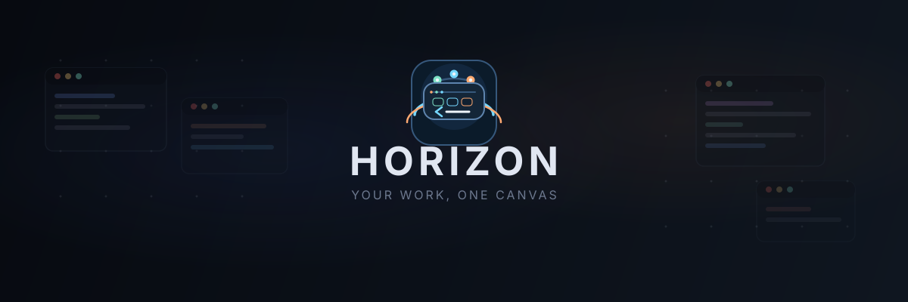

<p align="center">
  <picture>
    <source media="(prefers-color-scheme: dark)" srcset="assets/hero-banner.svg" />
    <source media="(prefers-color-scheme: light)" srcset="assets/hero-banner.svg" />
    
  </picture>
</p>

<p align="center">
  <a href="https://github.com/peters/horizon/releases/latest"></a>
  <a href="https://github.com/peters/horizon/actions/workflows/ci.yml"></a>
  
  
</p>

<p align="center">
  <b>Horizon</b> is a GPU-accelerated terminal board that puts all your sessions<br/>
  on an infinite canvas. Workspaces group related panels. Presets launch them.<br/>
  The command palette jumps you there. Close the app — the board is still there tomorrow.
</p>

<p align="center">
  
</p>

<p align="center">
  <a href="#the-model">The model</a> ·
  <a href="#five-minutes-on-the-canvas">Five minutes</a> ·
  <a href="#highlights">Highlights</a> ·
  <a href="#install">Install</a> ·
  <a href="#keyboard-and-mouse">Shortcuts</a> ·
  <a href="#configuration">Config</a> ·
  <a href="#browser-panels">Browser</a> ·
  <a href="#speech-input-opt-in">Speech</a>
</p>

---

## Why Horizon?

Tabbed terminals hide your work. Tiled terminals box you in. **Horizon gives you a canvas** — an infinite 2D surface where every terminal, agent, browser, and editor lives as a panel you can place, resize, and group.

Think of it as a whiteboard for live sessions, with a structured workflow on top: color-coded workspaces, preset panels, a command palette, and fit-to-workspace whenever you want a clean overview.

---

## The model

Horizon has five nouns. Everything else is a shortcut, a preset, or a panel kind.

| Noun | What it is | How you use it |
|:-----|:-----------|:---------------|
| **Canvas** | The infinite 2D surface | Middle-mouse or Space+drag to pan. Ctrl+scroll to zoom. Minimap to jump. |
| **Workspace** | A color-coded cluster with a shared working directory | Ctrl+double-click the canvas and pick a preset, or click **New** in the sidebar. Arrange with **Default** (free), **Rows**, **Cols**, or **Grid**. Detach it to its own window. |
| **Panel** | One live surface inside a workspace | Shell, SSH, coding agent, browser, markdown, git, or usage. |
| **Preset** | A named template for a new panel | Command palette, Ctrl+double-click, or **Ctrl+Shift+N** (first preset). |
| **Session** | A saved board | Close Horizon and come back. **Ctrl+Shift+J** switches between saved boards. |

A typical board looks like this:

```
Session
└── Canvas
    ├── Workspace "Backend"     cwd: ~/projects/api
    │     ├── Shell
    │     ├── Grok
    │     ├── Browser  →  http://127.0.0.1:3000
    │     └── Git Changes
    └── Workspace "Frontend"    cwd: ~/projects/web
          ├── Shell
          └── Claude
```

Workspaces stay visible. There are no hidden tabs. If something is off-screen, pan, zoom, fit, or search — do not hunt through a tab strip.

### Panel kinds

| Kind | What you get |
|:-----|:-------------|
| `shell` | Login shell in the workspace directory |
| `ssh` | Remote shell — usually from the Remote Hosts overlay |
| `grok` · `claude` · `codex` · `open_code` · `gemini` · `kilo_code` · `pi` | First-class coding-agent TUIs, with session resume where the CLI supports it |
| `browser` | Live Chromium, Firefox, or Safari on the canvas, shared with agents |
| `editor` | Markdown split view (syntax + preview) |
| `git_changes` | Changed files, diffs, and hunks for the workspace repo |
| `usage` | Token spend across agent panels |
| `command` | Run an arbitrary command as a panel |

---

## Five minutes on the canvas

You do not need a config file to start. Launch Horizon, then:

1. **Ctrl+double-click** empty canvas. A preset list appears. Pick **Shell** (or **Grok**, **Claude**, **Browser**, …). Shell and agent presets then ask for a working directory — that becomes the workspace cwd, and the first panel lands there.
2. Press **Ctrl+Shift+N** for another panel of the first preset (Shell by default), or **Ctrl+Shift+K** and type a preset alias (`gb`, `cc`, `web`, `gc`).
3. On the workspace header, click **Rows**, **Cols**, or **Grid** when you want structure, or **Default** to drag freely.
4. Press **Ctrl+Shift+9** to fit the workspace into view. Press **Ctrl+Shift+W** to jump back to it without changing zoom.
5. Press **Ctrl+Shift+K** again. Type a workspace name, a panel title, `@` for panels only, or `>` for presets and actions.
6. Close Horizon. Reopen it tomorrow — the session, layout, canvas pan/zoom, and terminal history are still there.

Once that loop is familiar, the rest is optional: **New** in the sidebar for an empty workspace, **Ctrl+Shift+H** for SSH/Tailscale hosts, the workspace **Detach** control for a dedicated window, a Browser panel for a live page, or Settings (**Ctrl+Shift+,**) to edit `~/.horizon/config.yaml` with the canvas still visible behind it.

---

## Highlights

<table>
<tr>
<td width="50%">

### Infinite Canvas
Pan and zoom freely. Place panels anywhere. A **minimap** in the corner keeps you oriented — click or drag it to jump.

</td>
<td width="50%">

### Workspaces
Group related panels into **color-coded workspaces**. Auto-arrange with rows, columns, or grid — or drag freely. **Detach** a workspace into its own OS window.

</td>
</tr>
<tr>
<td>

### Full Terminal Emulation
24-bit color, mouse reporting, scrollback, alt-screen, and Kitty keyboard protocol. Powered by the **Alacritty terminal engine**. Click a TUI (Grok, vim, less, …) and the click goes to the app; **Shift+click** still selects text.

</td>
<td>

### Command Palette
**Ctrl+Shift+K** searches workspaces, panels, presets, and actions. Prefix `>` for presets and actions, `@` for panels only. Selecting a panel pans the canvas to it.

</td>
</tr>
<tr>
<td>

### AI Agent Panels
First-class **Grok**, **Claude Code**, **Codex**, **OpenCode**, **Gemini CLI**, **KiloCode**, and **Pi** integration. Session persistence and resume work where the CLI supports it. Title bars show a **working** indicator and, when a session is bound, its id. A live **usage dashboard** tracks token spend.

</td>
<td>

### Live Browser
Run Chromium, Firefox, or Safari automation on the canvas. You and an agent share the same live page — navigate, inspect, click, fill, capture network traffic, then hand control back and forth.

</td>
</tr>
<tr>
<td>

### Git Integration
A built-in **git status panel** watches the workspace repo. See changed files, inline diffs, and hunk-level detail without leaving the canvas.

</td>
<td>

### Smart Detection
**Click** an OSC 8 hyperlink to open it. **Ctrl+click** a URL or file path under the cursor. Horizon sees what the terminal prints and makes it interactive.

</td>
</tr>
<tr>
<td>

### Remote Hosts
**Ctrl+Shift+H** discovers hosts from SSH config and Tailscale. Search, filter, and connect. Type **user@filter** to override the SSH user. Connected sessions land in a **Remote Sessions** grid workspace.

</td>
<td>

### Live Settings Editor
**Ctrl+Shift+,** opens the config as a side panel with YAML highlighting and live preview. Toggle **light / dark / auto** themes; changes apply to the canvas behind the editor.

</td>
</tr>
<tr>
<td>

### Session Persistence
Close Horizon, come back tomorrow. Sessions, panel layouts, canvas pan/zoom, and terminal history restore as you left them. **Ctrl+Shift+J** switches boards. An opt-in setting can line attached workspaces into a horizontal row after restore.

</td>
<td>

### Markdown Editor
Drop a `.md` file onto the canvas or create one from the palette. **Split view** with syntax highlighting and live preview, saved with **Ctrl+Shift+S**.

</td>
</tr>
<tr>
<td>

### Speech Input
Opt-in, on-device dictation into terminals and browser pages. Hold a push-to-talk key (default **F9**) or use the title-bar mic. Nothing leaves the machine.

</td>
<td>

### Audited Browser Automation
Agents discover one MCP browser contract automatically. Every action is correlated in a redacted audit trail. The `horizon-browser` CLI runs prompt jobs and repeatable JSON plans.

</td>
</tr>
</table>

---

## Install

### Download (fastest)

Grab the latest release from [**Releases**](https://github.com/peters/horizon/releases/latest) — no dependencies needed.

| Platform | Raw binary | Surge installer | |
|:---------|:-----------|:----------------|:-|
| **Linux** x64 | `horizon-linux-x64.tar.gz` | `horizon-installer-linux-x64.bin` | Extract and run, or use the installer for managed stable updates |
| **macOS** arm64 | `horizon-osx-arm64.tar.gz` | `horizon-installer-osx-arm64.bin` | Extract and run, or use the installer for managed stable updates |
| **macOS** x64 | `horizon-osx-x64.tar.gz` | `horizon-installer-osx-x64.bin` | Extract and run, or use the installer for managed stable updates |
| **Windows** x64 | `horizon-windows-x64.exe` | `horizon-installer-win-x64.exe` | Run the raw binary directly, or use the installer for managed stable updates |

Homebrew and other package-manager installs keep using the package manager's own upgrade flow. Horizon only offers the in-app update prompt for installs created by the Surge installer.

### Homebrew

Stable releases are available through the `peters/horizon` tap on macOS and Linux x64:

```bash
brew install peters/horizon/horizon
```

If you prefer to add the tap explicitly first:

```bash
brew tap peters/horizon
brew install horizon
```

To update or remove it later:

```bash
brew upgrade horizon
brew uninstall horizon
brew untap peters/horizon
```

### WinGet

Stable releases are submitted to the official Windows Package Manager catalog. After a release's manifest PR is approved, install, upgrade, or remove Horizon with:

```powershell
winget install Peters.Horizon
winget upgrade Peters.Horizon
winget uninstall Peters.Horizon
```

### Snap

Stable releases are also published to the Snap Store on Linux x64 as a classic snap:

```bash
sudo snap install horizon-ui --classic
snap refresh horizon-ui
snap remove horizon-ui
```

Classic confinement is intentional. Horizon launches host shells and host tools such as `ssh`, `git`, `xdg-open`, `pgrep`, `lsof`, and optional `tailscale` helpers, so a strict sandbox would compromise core workflows.

### Build from source

```bash
git clone https://github.com/peters/horizon.git
cd horizon
git lfs install
git lfs pull
cargo run --release
```

> Requires **Git LFS** for bundled assets and **Rust 1.95+**. Linux needs system headers for GPU rendering — see [AGENTS.md](AGENTS.md#prerequisites) for per-distro install commands.

---

## Keyboard and mouse

Most app shortcuts use **Ctrl+Shift** so they do not steal shell chords (Ctrl+C, Ctrl+K, Ctrl+B, …) or OS bindings. Canvas zoom keeps **Ctrl/Cmd+0**, **Ctrl/Cmd+Plus**, and **Ctrl/Cmd+Minus**. Bindings live in the `shortcuts:` block and in Settings. Duplicate or overlapping bindings are rejected, including near-conflicts such as `Ctrl+B` and `Ctrl+Shift+B`.

| Shortcut | What it does |
|:---------|:-------------|
| **Ctrl+Shift+K** | Command palette — jump to a workspace, panel, preset, or action |
| **Ctrl+Shift+N** | New panel from the first preset |
| **Ctrl+Shift+W** | Focus the active workspace at the current zoom |
| **Ctrl+Shift+9** | Fit the active workspace into view |
| **Ctrl+Shift+H** | Open Remote Hosts overlay |
| **Ctrl+Shift+J** | Open the sessions picker |
| **Ctrl+Shift+B** | Toggle sidebar |
| **Ctrl+Shift+U** | Toggle HUD |
| **Ctrl+Shift+M** | Toggle minimap |
| **Ctrl+Shift+A** | Align visible attached workspaces into a horizontal row |
| **Ctrl+Shift+,** | Open settings editor |
| **Ctrl+Shift+F** | Focus the terminal search bar |
| **Ctrl+0** | Reset canvas zoom to 100% |
| **Ctrl+Plus** | Zoom canvas in |
| **Ctrl+Minus** | Zoom canvas out |
| **F11** | Fullscreen the active panel |
| **Escape** | Exit active panel fullscreen |
| **Ctrl+Shift+F11** | Toggle window fullscreen |
| **Ctrl+Shift+S** | Save the active Markdown editor |
| **Ctrl+Shift+C** | Copy the current terminal selection |
| **Ctrl+Shift+V** | Paste into the focused terminal |
| **Ctrl+Shift+R** | Reconnect the focused disconnected SSH panel |

| Interaction | What it does |
|:------------|:-------------|
| **Middle-mouse drag** | Pan the canvas |
| **Space + Left-click drag** | Pan the canvas |
| **Minimap click-and-drag** | Jump to that area of the canvas |
| **Ctrl+Scroll** | Zoom around the cursor |
| **Click** in a mouse-reporting TUI | Deliver the click to the app (Grok, vim, less, …) |
| **Shift+Click/drag** | Select terminal text while the app has mouse reporting |
| **Click** an OSC 8 hyperlink | Open the link in the default handler |
| **Ctrl+Click** | Open URL, file path, or hyperlink under cursor |
| **Ctrl+double-click** canvas | Open the preset picker (creates a workspace and its first panel) |
| **Ctrl+double-click** inside a workspace | Open the preset picker to add a panel |

<sub>On macOS, substitute Cmd for Ctrl. Copy and paste use the standard Cmd+C / Cmd+V bindings, and on Windows you can also use Ctrl+Insert / Shift+Insert. The SSH reconnect shortcut is contextual and is disabled if another global shortcut overlaps with Ctrl+Shift+R.</sub>

---

## Configuration

The settings editor writes back to the same file Horizon loaded. By default that is `~/.horizon/config.yaml` (`config.yml` is also accepted). You can seed workspaces, panel presets, feature flags, and shortcuts.

Workspace templates use `terminals:` (each entry needs a `name`). Unknown keys are ignored, so a `panels:` block will not create anything.

```yaml
appearance:
  theme: auto # auto, light, or dark

shortcuts:
  command_palette: Ctrl+Shift+K
  new_terminal: Ctrl+Shift+N
  focus_active_workspace: Ctrl+Shift+W
  fit_active_workspace: Ctrl+Shift+9
  open_remote_hosts: Ctrl+Shift+H
  toggle_sessions: Ctrl+Shift+J
  toggle_sidebar: Ctrl+Shift+B
  toggle_hud: Ctrl+Shift+U
  toggle_minimap: Ctrl+Shift+M
  align_workspaces_horizontally: Ctrl+Shift+A
  toggle_settings: Ctrl+Shift+Comma
  zoom_reset: Ctrl+0
  zoom_in: Ctrl+Plus
  zoom_out: Ctrl+Minus
  fullscreen_panel: F11
  exit_fullscreen_panel: Escape
  fullscreen_window: Ctrl+Shift+F11
  save_editor: Ctrl+Shift+S
  search: Ctrl+Shift+F

workspaces:
  - name: Backend
    cwd: ~/projects/api
    terminals:
      - name: Shell
        kind: shell
      - name: Grok
        kind: grok
      - name: App
        kind: browser
        command: http://127.0.0.1:3000
      - name: Git
        kind: git_changes

  - name: Frontend
    cwd: ~/projects/web
    terminals:
      - name: Shell
        kind: shell
      - name: Claude
        kind: claude

presets:
  - name: Shell
    alias: sh
    kind: shell
  - name: Grok
    alias: gb
    kind: grok
  - name: Claude Code
    alias: cc
    kind: claude
    args:
      - --permission-mode
      - auto
  - name: Codex
    alias: cx
    kind: codex
    args:
      - --no-alt-screen
  - name: OpenCode
    alias: oc
    kind: open_code
  - name: Gemini CLI
    alias: gm
    kind: gemini
  - name: KiloCode
    alias: kc
    kind: kilo_code
  - name: Pi
    alias: pi
    kind: pi
  - name: Browser
    alias: web
    kind: browser
  - name: Git Changes
    alias: gc
    kind: git_changes
  - name: Markdown
    alias: md
    kind: editor
  - name: Usage
    alias: u
    kind: usage

features:
  # Optional: disable the default attention feed
  attention_feed: false
  # Optional: align attached workspaces whenever a session loads, including startup
  organize_workspaces_on_session_load: true
  # Optional: collapse inactive workspaces in the sidebar
  sidebar_accordion: true
```

`features.organize_workspaces_on_session_load` defaults to `false`. When enabled, Horizon performs the same horizontal alignment as **Ctrl+Shift+A** whenever a restored session is ready, both at startup and after an in-app session switch; detached workspaces are unchanged. A short **Preparing session view…** overlay blocks root-window input while restored window geometry settles. The default-disabled path does not show this overlay. Changing the setting in the live editor takes effect when a session is next loaded.

`features.sidebar_accordion` defaults to `false`. When enabled, only the active workspace lists panels in the sidebar; other workspaces collapse to a name, accent, and panel count. Enable it from Settings → General → Features or by setting the flag in `config.yaml`. Like other General feature toggles, the Settings editor applies the change immediately as a live preview; save to persist it, or close/revert without saving to restore the previous value.

Use key names like `Plus`, `Minus`, `Comma`, `Escape`, and `F11` in YAML instead of punctuation-only shortcut components such as `Ctrl++`.

Fresh configs already ship the agent, browser, git, markdown, and usage presets above. Existing configs gain missing defaults through migration (Grok, Pi, Browser, and the others) without overwriting presets you renamed.

### Launch flags

| Flag | What it does |
|:-----|:-------------|
| `--config <path>` / `-c <path>` | Load an explicit config file |
| `--ephemeral` | Do not persist this run |
| `--new-session` | Start a new saved session from the current config |
| `--blank` | Start with an empty board (combine with `--ephemeral` for a throwaway canvas) |

---

## Browser Panels

Browser panels render a real browser on the canvas through the first-party `horizon-browser` engine. Add one from the **Browser** (`web`) preset, or declare it in a workspace — `command` is the initial URL:

```yaml
workspaces:
  - name: Web
    terminals:
      - name: App
        kind: browser
        command: http://127.0.0.1:3000
```

The panel is a shared human-and-agent session. It can:

- navigate, reload, traverse history, wait for page state, and query or snapshot semantic DOM nodes;
- click (including trusted double-click), fill, scroll, evaluate bounded JavaScript, and keep the URL while the page scrolls;
- start visible or hidden, switch visibility without losing the session, and pause automation so you can steer before handing the same panel back;
- capture bounded HTTP metadata and response bodies plus high-rate WebSocket frames on Chromium and Firefox;
- reconnect an MCP client without restarting the browser, and keep a redacted action audit after the panel closes.

Safari shares the semantic action and audit surface but currently reports network capture as unsupported.

| Backend | Automation and pixels | Prerequisites | Important limits |
|:--|:--|:--|:--|
| **Chromium** | CDP with change-driven JPEG screencast frames | Chrome, Chromium, Edge, or Brave | Push frames; separate persistent profile per panel |
| **Firefox** | WebDriver BiDi plus adaptive lossless WebDriver screenshots | Firefox and `geckodriver` | Screenshots, not a live BiDi video stream; capture decays to zero on a static page and is capped at 30 fps while active |
| **Safari** | Classic WebDriver screenshots, with BiDi events when `webSocketUrl` is negotiated | macOS, Safari, and an explicitly enabled `safaridriver` | One automation session at a time; isolated Safari automation state |

Horizon scans the usual executable names and platform install locations. It never runs `safaridriver --enable`; follow Apple's one-time enablement flow yourself. Safari remains disabled in the picker on Linux and Windows.

```yaml
browser:
  backend: chromium              # chromium, firefox, or safari
  command: /path/to/chrome       # Chromium-family binary; omit to discover
  firefox_command: /path/to/firefox
  geckodriver_command: /path/to/geckodriver
  safaridriver_command: /usr/bin/safaridriver
  extra_args: []                 # managed browser switches are rejected
  quality: 60                    # Chromium JPEG screencast quality, 1–100
  every_nth_frame: 1             # Chromium screencast sampling
  profile_root: ~/.horizon/browser-profiles
```

All executable fields are optional. Chromium and Firefox get separate directories under `profile_root`. Permanently closing the panel or deleting its saved session removes that panel's profile. Safari always uses Safari's isolated automation window and does not reuse your normal history, cookies, or preferences.

### Agent steering, audit, and CLI

Horizon-launched Codex and Claude agents receive the bundled `horizon-browser` MCP server automatically. Agents start with `browser_list` and use `browser_create` to open a visible browser in their own workspace when none exists. They reuse that panel for iframe, popup, dialog, and consent flows. A fresh user page action pauses the agent queue for five seconds; an explicit handoff keeps it paused until you select **Done — hand back to agent**.

MCP is the only agent-facing browser contract. Audit journals live under `~/.horizon/audit/browsers/` and redact credentials, query values, and typed text (stored as a character count). See the [browser crate README](crates/horizon-browser/README.md) for backend and embedding details.

For scripts, [`horizon-browser-cli`](crates/horizon-browser-cli/README.md) exposes the same MCP tools three ways: a quoted goal, a deterministic `run` plan, or `mcp` as a standalone stdio server. Deterministic `run` jobs remain model-free and atomically publish a private job id, validated plan, and deadline-bound prepared lifecycle state together; runs that reach plan execution also persist a final report. After plan validation, durable preparation and MCP execution share a 30-minute default action deadline that can be changed with `--timeout`; timed-out reports preserve completed steps. Ctrl-C remains active while plan input is open and through preparation, MCP work, and final report delivery; it exits with code 130, gives durable cancellation a bounded flush grace, and cannot be trapped by blocked report output. An in-flight mutation is never claimed safe to replay.

```bash
cargo build -p horizon-browser-cli
target/debug/horizon-browser "Go to example.com, extract the heading, save to heading.txt"
target/debug/horizon-browser run browser-job.json --output browser-report.json
target/debug/horizon-browser mcp --backend firefox --visible
```

---

## Speech Input (opt-in)

Dictate into a terminal or a browser page. Terminal-backed and Browser panels get a mic button in the title bar (Editor, Git Changes, and Usage panels do not). A Ventrilo-style **push-to-talk hotkey** (default `F9`, hold to record) dictates into the focused text-input panel. Audio is transcribed locally by [transcribe.cpp](https://github.com/handy-computer/transcribe.cpp) — nothing leaves the machine — and the text is inserted as if typed. Browser dictation targets the page element that currently owns DOM focus.

Speech is a compile-time opt-in because it builds a native C++ inference library. You need **CMake and a C++ compiler**, plus on Linux the ALSA headers (`libasound2-dev` / `alsa-lib-devel`):

```bash
cargo speech          # alias for: cargo run --release --features speech  (CPU inference; Metal on macOS)
cargo speech-cuda     # NVIDIA GPU inference (needs the CUDA toolkit)
cargo speech-vulkan   # any GPU via Vulkan (needs the Vulkan SDK to build)
```

On Linux, capture routes through PulseAudio/PipeWire whenever that sound server is running, so the microphone stays shared with other apps. Without a sound server it falls back to raw ALSA, which claims the device exclusively.

```yaml
features:
  speech:
    enabled: true
    model: /path/to/models/whisper-large-v3-Q8_0.gguf  # any transcribe.cpp GGUF
    language: "no"       # ISO hint; "auto" detects. Supported set = the model's GGUF metadata
    task: transcribe     # translate = speak any language, insert English text
    backend: auto        # auto | cpu | cuda | vulkan | metal
    input_device: ""     # microphone name; "" = system default
    hotkey: "F9"         # push-to-talk; same syntax as the shortcuts table, "" disables
    hotkey_mode: hold    # hold (Ventrilo-style) | toggle
    preload: false       # true = load the model at startup
    desktop_injection: false  # true = direct accessibility insertion into another app (macOS or X11 Linux); no clipboard
```

The push-to-talk hotkey listens in focused Horizon windows, and panels in detached windows can also dictate via their title-bar mic button. A focused terminal, editor, or browser panel receives the transcript locally (PTY, caret, or page `insertText`). Git Changes and Usage have no text surface. With `desktop_injection: true`, the same hotkey is grabbed globally on macOS and X11 Linux. On macOS, an external editable field is captured through Accessibility when recording starts and any later focus change discards the transcript. On Linux, the focused AT-SPI editable field is validated when the transcript is ready. Both paths insert directly without reading or writing the clipboard, sending a paste shortcut, or pressing Return. Background push-to-talk is unavailable in a pure Wayland session.

Recommended models (prebuilt GGUFs under [`handy-computer`](https://huggingface.co/handy-computer) on Hugging Face): `whisper-large-v3-turbo` (fast multilingual), `whisper-large-v3` (multilingual with a working `translate` task), `parakeet-tdt-0.6b-v3` (fast, 25 European languages). For Norwegian — including dialects — convert [NB-Whisper Large](https://huggingface.co/NbAiLab/nb-whisper-large) to GGUF per the transcribe.cpp docs and set `language: "no"` (or `"nn"`). NB-Whisper normalizes dialect speech into standard written Norwegian and ignores the `translate` task; spoken-Norwegian → English text needs stock `whisper-large-v3`.

Settings → General → Features → **Speech Input** exposes all of this with a model-aware UI: languages from the GGUF metadata, a rebindable push-to-talk key, a microphone picker, and the actually-selected backend next to `auto`. Saved changes apply live.

### Speech profiles: one key per language

Each profile has its own model, language, output, and push-to-talk key. Hold **F1** for Norwegian, **F2** for English, **F3** to speak Norwegian and insert English. Models load lazily on first use unless `preload: true`.

```yaml
features:
  speech:
    enabled: true
    backend: auto
    hotkey_mode: hold
    profiles:
      - name: Norsk
        model: ~/models/nb-whisper-large-Q8_0.gguf
        language: "no"
        task: transcribe
        hotkey: F1
        preload: true
      - name: English
        model: ~/models/whisper-large-v3-Q8_0.gguf
        language: en
        task: transcribe
        hotkey: F2
      - name: NO→EN
        model: ~/models/whisper-large-v3-Q8_0.gguf
        language: "no"
        task: translate
        target_language: en
        hotkey: F3
```

Profile hotkeys are validated against each other and against every global shortcut. The mic button uses the last-used profile; with no `profiles:` list, the flat `model` / `language` / `hotkey` fields act as a single profile.

---

## Built With

| | |
|:--|:--|
| [**Rust**](https://www.rust-lang.org) | Edition 2024, safe and fast |
| [**eframe / egui**](https://github.com/emilk/egui) | Immediate-mode UI framework |
| [**wgpu**](https://wgpu.rs) | GPU rendering — Vulkan, Metal, DX12, OpenGL |
| [**alacritty_terminal**](https://github.com/alacritty/alacritty) | Battle-tested terminal emulation |
| [**Catppuccin**](https://catppuccin.com) | Terminal palettes (Mocha dark / Latte light) on a warm editorial UI chrome |

---

## Contributing

See [**AGENTS.md**](AGENTS.md) for development setup, architecture, coding standards, and CI requirements.
Release instructions live in [**docs/release-flow.md**](docs/release-flow.md).
Manual smoke-test plans live under [**docs/testing**](docs/testing).

```bash
cargo fmt --all -- --check
cargo test --workspace
cargo clippy --all-targets --features speech,trace-profiling -- -D warnings
```

---

<p align="center">
  <sub>MIT License</sub>
</p>
